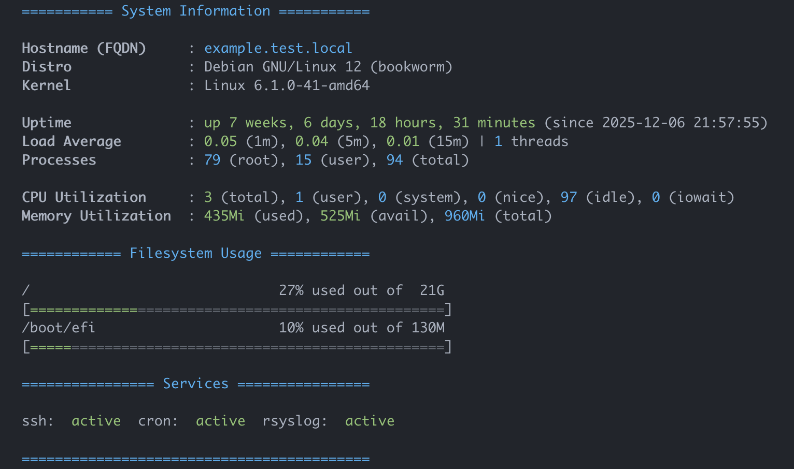

# motd

Simple bash scripts for The Message of the Day.

Inspired by [yboetz/motd](https://github.com/yboetz/motd) GitHub repo.

## Features

...that are not visible on the screenshot.

- 20-sysinfo
  - Prints uptime in red, if it's < 1 day
  - Prints load average in red, if it's > 1.5 of processing units
  - Prints total CPU utilization in red if it's > 75, or in yellow if it's > 50
  - Prints memory utilization in red if it's > 80, or in yellow if it's > 60
- 21-filesystems
  - Prints usage in yellow if it's > 80, or in red if it's > 90
- 22-services
  - Prints status of the service in red if it's not running

